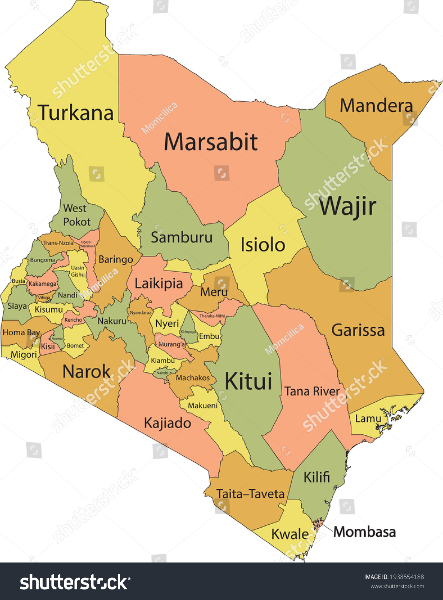

```{r setup, include=FALSE}
knitr::opts_chunk$set(
	echo = TRUE,
	#fig.height = 4,
	#fig.width = 7,
	message = FALSE,
	warning = FALSE,
	comment = NA)
```

## confirmation and setting of working directory

Working directory in R is the default location on your computer where R reads and writes files.

Setting the working directory ensures that your files are saved and loaded from the intended locations, streamlining your workflow

```{r}
setwd("C:/Users/LUMUMBA/OneDrive/Documents/TMMS2024_2")
```


## Installation and loading of necessary packages/libraries

# Installing packages

# Loading libraries

```{r}
library(tidyverse)    ##for data manipulation
library(psych)          ##for description of  data
library(summarytools)   ##for summarizing data
library(sjmisc)       ##for data manipulation
```

# Load Example data 
```{r}
malaria_data <- read.csv("mockdata_cases.csv")
mosquito_data <- read.csv("mosq_mock.csv")
```

# Characterizing the data
Before we start visualizing our data, we need to understand the characteristics of our data. The goal is to get an idea of the data structure and to understand the relationships between variables.

# Explore the structure and summary of the datasets
```{r}
dim(malaria_data) ## Dimension of the dataset
str(malaria_data) ## The structure of the dataset
```

### View the Columns Names
```{r}
colnames(malaria_data)
```

```{r}
head(malaria_data) ## View the first few rows
```

```{r}
summary(malaria_data) ### Summary of the descriptive Statistics
```

```{r}
describe(malaria_data) ### Descriptive Statistics
```

### Alternatively
```{r}
describeBy(malaria_data)
```

#We should also explore individual columns/variables

```{r}
#malaria_data$location          # values for a single column (locations)
#malaria_data$month     # values for a single column (months)
#malaria_data$year     # values for a single column (year)
```


```{r}
unique(malaria_data$location)  # unique values for a single column
unique(malaria_data$year)
```

```{r}
table(malaria_data$location)   # frequencies for a single column
frq(malaria_data$location)
```

```{r}
prop.table(table(malaria_data$location)) # percentages for a single column
```


```{r}
table(malaria_data$location, malaria_data$year)  # frequencies for multiple columns
```

# check for missing values in each column, as these can affect our visualizations.
```{r}
sum(is.na(malaria_data)) #checking for missing values in the dataset
```
# Check Columns with Missing values in the data set
```{r}
library(kableExtra)
missing_values <- colSums(is.na(malaria_data))
kable(missing_values)
```


# ---------------------------------------------------------------------------
# Challenge 1: Explore the structure and summary of the mosquito_data dataset
# ---------------------------------------------------------------------------
What are the dimensions of the dataset?

What are the column names?

What are the column types?

```{r}
#sapply(mosquito_data, class)
```

What are some key variables or relationships that we can explore?

# -------------------------------------------------------
# Data Visualization Using Base R Functions
# ------------------------------------------------------
First, we will look at some exploratory data visualization techniques using base R functions. The purpose of these plots is to help us understand the relationships between variables and characteristics of our data. They are useful for quickly exploring the data and understanding the relationships, but they are not great for sharing in scientific publications/presentations.

## (OBJECTIVE) After completing this session, you should be able to;

# Explain the various types of graphics available in R
# List the possible file formats of graphic outputs
# Describe the methods to save graphics as files
# Describe the procedure to export graphs in Rstudio

## Graphics in R
R includes powerful packages of graphics that help in data visualization. These graphics can be: Viewed on the screen, saved in various formats such as ,pdf, .png, .jpg etc and customized according to the varied graphic needs. 

## Types of Graphics
R supports 8 types of graphics: Bar charts, Pie Charts, Histogram, line charts, box plot, Kernel density plot, Heat map, word cloud.


# Single variable comparison

#1. Histogram
For one variable comparison, we can use hist() function to create a histogram.
Histogram displays the distribution of continuous variable and the frequency of scores in each bin on y-axix by dividing the ranges of scores into bins on the x-axis

```{r}
hist(malaria_data$prev)
hist(malaria_data$prev, col = "tomato")
```

### Save the Plot as pdf
```{r}
pdf("Histogram Plot.pdf")
hist(malaria_data$prev, 
    breaks = 10, 
    col = "steelblue",
    border = "red",
    main = "Distribution of Malaria Prevalence",
    xlab = "Malaria Prevalence",
    ylab = "Frequency")
dev.off()
```

### Save the Plot as PNG
```{r}
png("Histogram Plot.png")
hist(malaria_data$prev, 
    breaks = 10, 
    col = "steelblue",
    border = "red",
    main = "Distribution of Malaria Prevalence",
    xlab = "Malaria Prevalence",
    ylab = "Frequency")
dev.off()
```

#2. Kernel Density Plots
These display the distribution of a continuous variable much more efficiently than histogram

```{r}
density <- density(malaria_data$prev)

plot(density)
polygon(density, col="red",border="black")
```


```{r}
#Save as PDF in Rstudio
pdf("Kernel Density Plots.pdf", width = 8, height = 6)      # Open PDF device
plot(density)                                               # Create the plot
polygon(density, col="red",border="black")                  
dev.off()                                                   # Close device & finalize the file
```
#3. Line chart
Line charts represent a series of data point connected by a straight line and are generally used to visualize data that changes over time.
```{r}
plot(malaria_data$year,malaria_data$positive, type="l", lwd=1, xlab="Year", ylab="Positive Cases", main="A Line plot of Positive Cases across Years")
```

### A Line Plot of Positive Cases Against Total
```{r}
plot(malaria_data$total, malaria_data$positive, 
     xlab = "Total", 
     ylab = "Positive Cases", 
     main = "A Line Plot Positive Cases against Tota Tests",
     type ="l")
```


#4. Barplot
Another useful function for single variable comparisons is barplot(). In this case, we will use the table() function to count the number of observations in each category, then use barplot() to create a barplot.

Barcharts are horizontal or vertical bars to show comparisons between categorical values.  They represent lengths, frequency or proportions of categorical values

```{r}
counts <- table(malaria_data$year)
counts
barplot(counts, col = "steelblue")
```

```{r}
counts <- table(malaria_data$year)
barplot(counts,
        col=c("red", "blue", "green"),
        main= "Simple Bar chart",
        xlab= "Year",
        ylab="Frequency")                                        # Close device
```

```{r}
#Save as PNG in Rstudio
png("Simple Bar chart.png")                       # Open PNG device
barplot(counts,                                   # Create the plot
        col=c("red", "blue", "green"),
        main= "Simple Bar chart",
        xlab= "Year",
        ylab="Frequency")               
dev.off()  
```

# Pie charts
It is a type of graph in which a circle is divided into sectors, each representing a proportion of the whole.

```{r}
df <- as.data.frame(table(malaria_data$location))
colnames(df) <- c("location", "freq")

pie(df$freq,                                         #data for the pie chart
    df$location,                                     #lables for the slices
    col =rainbow(length(df$freq)),                   #colour palette for the slices
   main = "Malaria cases Distribution by Location" ) 
```

```{r, fig.height=6, fig.width=7}
df <- prop.table(table(malaria_data$location))
p1<-pie(df, 
        labels = paste(names(df), "(", round(df * 100, 1), "%)"), 
        col = c("7","2","3","4","5"), main = "Pie Chart for Location Categories")
```

```{r, fig.width=10, fig.height=7}
library(plotrix)
df <- prop.table(table(malaria_data$location))
p1<-pie3D(df, labels = paste(names(df), "(", round(df * 100, 1), "%)"), col = c("7","2","3","4","5"), main = "Pie Chart for Location Categories")
pdf("3 D Pie Chart.pdf")
pie3D(df, labels = paste(names(df), "(", round(df * 100, 1), "%)"), col = c("7","2","3","4","5"), main = "Pie Chart for Location Categories")
dev.off()
```


```{r}
library(plotly)
df <- as.data.frame(table(malaria_data$location))
colnames(df) <- c("location", "freq")


fig <- plot_ly(df,
               labels = ~df$location,
               values = ~df$freq,
               type = 'pie',
               hole = 0.3,                  # Makes a doughnut chart; set to 0 for a full pie chart
               textinfo = 'label+percent',  # Shows both labels and percentages
               marker = list(colors = colorRampPalette(c('blue', 'green', 'tomato', 'skyblue'))(nrow(df))))

fig
```

# Multiple variables
For multiple variables, we can use plot() function to create a scatterplot, mulptiple bar chart, boxplot etc. 

In this case, we will use plot() to create a scatterplot. The first argument in plot() is the x variable, and the second argument is the y variable.

# scatterplot
```{r}
plot(malaria_data$total, malaria_data$positive)
plot(malaria_data$total, malaria_data$positive, col="red")

#Save as JPEG in Rstudio
jpeg("Scatter plot.jpg")                                        # Open JPEG device
plot(malaria_data$total, malaria_data$positive, col="red")      # Create the plot
dev.off()                                                       # Close device
```
# Multiple Bar chart
```{r, fig.height=7}
counts <- table(malaria_data$year,malaria_data$ages)
barplot(counts,
        col=c("red", "blue", "green"),
        main= "Multiple Bar chart of Ages Brackets Across Years",
        xlab= "Years",
        ylab="Frequency",
        legend=rownames(counts), beside=TRUE)
```
# Boxplot

A boxplot, also known as a box-and-whisker plot, is a standardized way of displaying the distribution of data based on a five-number summary: minimum, first quartile (Q1), median, third quartile (Q3), and maximum.

# Importance of Boxplots
  * Provide a clear and concise visual summary of the data distribution, showing central tendency,                    variability, and symmetry or skewness.
  
  * They are excellent tools for comparing distributions across different groups or categories, allowing quick        visual comparisons.
  
  * Identifying Outliers: Boxplots help identify outliers in the data, which can be crucial for understanding data     quality and distribution.
  
  * Understanding Spread: They reveal the spread and range of the data, indicating the variability within the         dataset
  
```{r}
boxplot(malaria_data$prev ~ malaria_data$location)
boxplot(malaria_data$prev ~ malaria_data$location, col="tomato") 

#Save as TIFF in Rstudio
tiff("Box-and-Whisker plot.tiff", width = 800, height = 600)          # Open TIFF device
boxplot(malaria_data$prev ~ malaria_data$location, col="tomato")      # create the plot
dev.off ()                                                            # Close device
```

# ---------------------------------------------------------------------------
# Challenge 2: Explore the structure and summary of the mosquito_data dataset
# ---------------------------------------------------------------------------
Are their any interesting patterns in individual variables/columns?
Are there any relationships between variables/columns?

# --------------------------------------------------------------------------
# Data Visualization with ggplot2 
# --------------------------------------------------------------------------
Base R functions like hist() and barplot() are great for quickly exploring our data, but we may want to use more powerful visualization techniques when preparing outputs for scientific reports, presentations, and publications.

The ggplot2 package is a popular visualization package for R. It provides an easy-to-use interface for creating data visualizations. The ggplot2 package is based on the “grammar of graphics” and is a powerful way to create complex visualizations that are useful for creating scientific and publication-quality figures.

The “grammar of graphics” used in ggplot2 is a set of rules that are used to develop data visualizations using a layering approach. Layers are added using the ‘+’ operator.

# Components of a ggplot
There are three main components of a ggplot: 
1. The data: the dataset we want to visualize 
2. The aesthetics: the visual properties from the data used in the plot 
3. The geometries: the visual representations of the data (e.g., points, lines, bars)

# The data
All ggplot2 plots require a data frame as input. Just running this line will produce a blank plot because we have stated which elements from the data we want to visualize or how we want to visualize them.

```{r}
ggplot(data = malaria_data) 
```

# The aesthetics
Next, we need to specify the visual properties of the plot that are determined by the data. The aesthetics are specified using the aes() function. The output should now produce a blank plot but with determined visual properties (e.g., axes labels).

```{r}
ggplot(data = malaria_data, 
       aes(x = total, y = positive)) 
```

# The geometries
Finally, we need to specify the visual representation of the data. The geometries are specified using the geom_* function. There are many different types of geometries that can be used in ggplot2. We will use geom_point() in this example and we will append it to the previous plot using the + operator. The output should now produce a plot with the specified visual representation of the data.

```{r}
library(ggthemes)
ggplot(data = malaria_data, aes(x = total, y = positive)) + 
  geom_point()

ggplot(data = malaria_data, aes(x = total, y = positive)) + 
  geom_point(colour = "tomato") 

ggplot(data = malaria_data, aes(x = total, y = positive)) + 
  geom_point() +
  geom_smooth(method = "lm")  # The smooth geom add a smoothed line to the plot

ggplot(data = malaria_data, aes(x = total, y = positive, color = location)) + 
  geom_point() +
  theme_classic()

ggplot(data = malaria_data, aes(x = total, y = positive, color = location)) + 
  geom_point() +
  theme_economist()

ggplot(data = malaria_data, aes(x = total, y = positive, color = location)) + 
  geom_point() +
  facet_wrap(~location) +
  theme_bw()

ggplot(data = malaria_data, aes(x = total, y = positive, color = location)) + 
  geom_point() +
  facet_wrap(~year) +
  theme_bw()

ggplot(data = malaria_data, aes(x = total, y = positive, color = location)) + 
  geom_point() +
  geom_smooth(method = "lm")  # The smooth geom add a smoothed line to the plo

ggplot(data = malaria_data, aes(x = total, y = positive, color = location)) + 
  geom_point() +
  stat_ellipse() +
  theme_classic()
```

```{r}
ggplot(data = malaria_data, aes(x= prev))+
  geom_histogram(bins = 10, fill = "red", color = "blue")
ggsave("ggplot histogram.pdf", height = 5, width = 6,dpi = 300)
```


#Here are some examples of different geom functions:

# Example data
data <- data.frame(Category = c("A", "B", "C", "A", "B", "C", "A", "A", "B", "C"))

# Plotting a bar chart

```{r}
ggplot(data = malaria_data, aes(x = year)) +
  geom_bar(fill = "skyblue")          # the "fill" argument specifies the color of the bars

ggplot(data = malaria_data, aes(x = year)) +
  geom_bar(fill = "tomato") +
  labs(title="Simple Bar Plot",
       x="Year",
       y="Frequency",
       caption = "Source: Malaria data, 2020") +
  theme_classic()
```

When using the aes() function, the visual properties will be determined by a variable in the dataset. This allows us to visualize relationships between multiple variables at the same time.

# Multiple Bar chart
```{r}
ggplot(data = malaria_data, aes(x = ages, y=positive, fill = ages)) +
  geom_bar(stat = "identity") +
  labs(title="Multiple Bar Plot",
       x="Age Group",
       y="Malaria Positive Cases Reported",
       caption = "Source: Malaria data") +
  theme_classic()


# Create multiple bar plots using facet_wrap()
ggplot(data = malaria_data, aes(x = ages, y=positive, fill = ages)) +
  geom_bar(stat = "identity") +
  facet_wrap(~year) +
  labs(title="Multiple Bar Plot by year",
       x="Age Group",
       y="Malaria Positive Cases Reported",
       caption = "Source: Malaria data") +
  theme_classic()
```

# Multiple Histogram
```{r}
ggplot(data = malaria_data, aes(x= prev, fill = ages))+
  geom_histogram(bins = 10) +
  theme_classic()

ggplot(data = malaria_data, aes(x= prev, fill = ages))+
  geom_histogram(bins = 10) +
  labs(title = "Multiple Histogram by Age group",
       x="Malaria Prevalance Rate",
       y="Numver of Malaria case",
       caption = "Source: Malaria data") +
  theme_classic()
```
```{r}
ggplot(data = malaria_data, aes(x = prev, fill = ages)) +
  geom_histogram(color = "black") +
theme_classic()
```


# -------------------------------------------------------------------------
# Challenge 3: Create ggplot2 visualizations of the ‘mosquito_data’ dataset
# -------------------------------------------------------------------------
Are their any interesting patterns in individual variables/columns?
How can we use the aes() function to view multiple variables in a single plot?
Are there any additional geometries that may be useful for visualizing this dataset?


#The examples above show how to use colors for categorical variables, but we can also use custom color palettes for continuous variables.

```{r}
ggplot(data = malaria_data, aes(x = total, y = positive, color = prev)) +
  geom_point() +
  scale_color_gradient(low = "blue", high = "red")
```

```{r}
ggplot(data = malaria_data, aes(x = total, y = positive, color = prev)) +
  geom_point() +
  # use viridis package to create custom color palettes
  scale_color_viridis_c(option = "magma")  
```


```{r}
ggplot(data = malaria_data, aes(x = location, y = prev)) +
  geom_boxplot(fill = "lightblue") +
  geom_jitter(alpha = 0.2) +
  theme_classic()
```


```{r}
ggplot(data = malaria_data, aes(x = location, y = prev, fill = location)) +
  geom_boxplot() +
  geom_jitter(alpha = 0.2, aes(color = location)) +
  theme_classic()
```


```{r}
library(ggpubr)
p <- ggplot(data = malaria_data, aes(x = location, y = prev, fill = location)) +
  geom_boxplot() +
  geom_jitter(alpha = 0.2, aes(color = location)) 
  # theme_classic()

#  Add p-value
#p + stat_compare_means()
```


```{r}
ggplot(data = malaria_data, aes(x = location, y = prev)) +
  geom_violin(fill = "tomato") +
  geom_jitter(alpha = 0.2) +
  theme_classic()
```


#Correlation matrix with ggally package
```{r}
library(GGally)

# correlation analysis 
data(malaria_data)
ggpairs(malaria_data, columns = 5:6, ggplot2::aes(colour=location))
```

# Scatterplot
```{r}
library(ggplot2)
library(ggExtra)

g <- ggplot(malaria_data, aes(total, positive)) + 
  geom_count(color = "red") + 
  geom_smooth(method="lm", se=F) 

ggMarginal(g, type = "histogram", fill="blue")

ggMarginal(g, type = "boxplot", fill="transparent")

ggMarginal(g, type = "density", fill="blue")
```

```{r}
library(leaflet)
# Sample data
attach(malaria_data)

# Create an interactive map with leaflet
leaflet(malaria_data) %>%
  addTiles() %>%
  addCircleMarkers(
    ~xcoord, ~ycoord,
    radius = ~prev *10,
    color = "red",
    stroke = FALSE,
    fillOpacity = 0.5,
    label = ~paste0(location, ": ", prev)) %>%
  addLegend("bottomright", 
            colors = "red", 
            labels = "Malaria Prevalence",
            title = "Prevalence")
```

### Malaria Synthetic Data for Kenya
```{r}

library(leaflet)
# Sample data 
kenya <- read.csv("KenyaMalariaGeo.csv", header = TRUE)

# Create an interactive map with leaflet
leaflet(kenya) %>%
  addTiles() %>%
  addCircleMarkers(
    ~longitude, ~latitude,
    radius = ~prevalence * 10,
    color = "red",
    stroke = FALSE,
    fillOpacity = 0.5,
    label = ~paste0(county, ": ", prevalence)) %>%
  addLegend("bottomright", 
            colors = "red", 
            labels = "Malaria Prevalence",
            title = "Prevalence in Kenya")
```


### Global Map using Malaria Data from KNBS
```{r}
data <- read.csv("malaria_survey_data1.csv")
View(data)

### Code the Counties and Give their Appropriate Name
data$County <- factor(data$County, levels = c(101, 201, 202, 203, 204, 205, 301, 302, 303, 304, 305, 306,
            401, 402, 403, 404, 405, 406, 407, 408, 501, 502, 503, 601, 602,
            603, 604, 605, 606, 701, 702, 703, 704, 705, 706, 707, 708, 709,
            710, 711, 712, 713, 714, 801, 802, 803, 804),
            labels = c("nairobi", "nyandarua", "nyeri", "kirinyaga", "muranga", "kiambu",
            "mombasa", "kwale", "kilifi", "tana river", "lamu", "taita taveta",
            "marsabit", "isiolo", "meru", "tharaka", "embu", "kitui", "machakos",
            "makueni", "garissa", "wajir", "mandera", "siaya", "kisumu", "migori",
            "homa bay", "kisii", "nyamira", "turkana", "west pokot", "samburu",
            "trans nzoia", "baringo", "uasin gishu", "elgeyo/marakwet", "nandi",
            "laikipia", "nakuru", "narok", "kajiado", "kericho", "bomet", "kakamega",
            "vihiga", "bungoma", "busia"))
head(data,10)
View(data)
```

```{r}
gps <- read.csv("longitude_latitude.csv")
head(gps, 10)
```

### Merge the data set
```{r}
data <- merge(gps, data, by = "County", all.x = TRUE)
head(data)
View(data)
```

### Mapping of Malaria Occurrences
```{r}
library(leaflet)

# Create an interactive map with leaflet
leaflet(data) %>%
  addTiles() %>%
  addCircleMarkers(
    ~Longitude, ~Latitude,
    radius = ~Final_Malaria_Test_Results*5,
    color = "red",
    stroke = FALSE,
    fillOpacity = 0.5,
    label = ~paste0(County, ": ", Final_Malaria_Test_Results)) %>%
  addLegend("bottomright", 
            colors = "red", 
            labels = "Malaria Results",
            title = "Malaria Positive Test Results")
```


## Alternatively
```{r}
# Create the new dataset
data2 <- data %>%
  group_by(County) %>%
  summarise(Total = n(),
            Results = sum(Final_Malaria_Test_Results))

data2
#write.csv(data2, "data2.csv")
```

```{r}
data2 <- read.csv("data2.csv")
data2
```

### Merge the Data with the GPS File
```{r}
results_prop <- data2 %>% 
  #filter(County != "KENYA") %>%
  mutate(county_title = str_to_title(County),
         prop_cases = Results/Total)
results_prop
```

```{r, fig.height=10}
##Graph
ggplot(results_prop, aes(x = prop_cases,
                          y = reorder(county_title, prop_cases))) +
  geom_col(fill = "navy", alpha = 0.6) +
  theme_minimal(base_size = 12.5) +
  scale_x_continuous(labels = scales::percent) +
  labs(title = "Percentage of Malaria Positive Cases across Counties",
       subtitle = "2023 KNBS",
       x = "Percentage Cases",
       y = "Counties",
       caption = "Data source:KNBS")
ggsave("Bargraph.pdf", height = 5, width = 6,dpi = 300)
```

### Map Chart
```{r, fig.height=6, fig.width=7}
library(rKenyaCensus)
library(tidyverse)
library(sf)
library(sp)
kenya_counties_sf <- st_as_sf(KenyaCounties_SHP)
View(kenya_counties_sf)
ggplot(kenya_counties_sf) +
geom_sf() +
theme_void()
```

### Map of Kenyan Counties and their Names
```{r}

```

```{r}
data2 <- read.csv("data3.csv")
results_prop <- data2 %>% 
  #filter(County != "KENYA") %>%
  mutate(county_title = str_to_title(County),
         prop_cases = Results/Total)
results_prop
```

### The MAP
```{r fig.height=8, fig.width=8}
## Map
#View(kenya_counties_sf)
kenya_results_map <- kenya_counties_sf %>%
  mutate(County = str_remove(County, " CITY")) %>%
  left_join(results_prop, by = "County")
#View(kenya_results_map)
ggplot(kenya_results_map, aes(fill = prop_cases)) +
  geom_sf() +
  scale_fill_viridis_c(labels = scales::percent) +
  theme_void() +
  labs(fill = "% of Positive Test Results",
       title = "Percentage of Positive Malaria Tests Results as a Fraction of the Total Tests",
       subtitle = "KNBS Data 2023",
       caption = "<span style='font-size:10pt;'>Source: <b style='color:black;'>Lumumba V.W, 2024</b></span><br>
                  <span style='color:purple; font-size:9pt;'>Center for Data Analytics & Modeling</span><br>
                  <span style='color:red; font-size:9pt;'>Chuka University, Kenya</span>") +
  theme(plot.caption = ggtext::element_textbox_simple(hjust = 1, halign = 1),
        plot.caption.position = "plot")

```

### Geospatial Map for of Actual Malaria Test Results
```{r, fig.height=6, fig.width=7}
data2 <- read.csv("data3.csv")
results <- data2 %>% 
  #filter(County != "KENYA") %>%
  mutate(county_title = str_to_title(County),
         cases = Results)

kenya_results_map <- kenya_counties_sf %>%
  mutate(County = str_remove(County, " CITY")) %>%
  left_join(results, by = "County")
#View(kenya_results_map)
ggplot(kenya_results_map, aes(fill = cases)) +
  geom_sf() +
  scale_fill_viridis_c() +
  #scale_fill_gradient(low = "lightblue", high = "darkblue") +
  theme_void() +
  labs(fill = "% of Positive Test Results",
       title = "Geospatial Map Total of Positive Malaria Tests Results in Kenya",
       subtitle = "KNBS Data 2023",
       caption = "<span style='font-size:10pt;'>Source: <b style='color:black;'>Lumumba V.W, 2024</b></span><br>
                  <span style='color:purple; font-size:9pt;'>Center for Data Analytics & Modeling</span><br>
                  <span style='color:red; font-size:9pt;'>Chuka University, Kenya</span>") +
  theme(plot.caption = ggtext::element_textbox_simple(hjust = 1, halign = 1),
        plot.caption.position = "plot")
```

## Africa Malaria Cases Per 1000 Population at Risk
### View the Map of Africa
```{r}
knitr::include_graphics("Africa.jpg")
```

```{r}
library(leaflet)
# Sample data 
africa <- read.csv("DatasetAfricaMalaria.csv", header = TRUE)
#View(africa)

# Create an interactive map with leaflet
leaflet(africa) %>%
  addTiles() %>%
  addCircleMarkers(
    ~longitude, ~latitude,
    radius = ~Incidence.of.malaria..per.1.000.population.at.risk.*0.01,
    color = "red",
    stroke = FALSE,
    fillOpacity = 0.5,
    label = ~paste0(Country.Name, ": ", Incidence.of.malaria..per.1.000.population.at.risk.)) %>%
  addLegend("bottomright", 
            colors = "red", 
            labels = "Malaria Prevalence",
            title = "Prevalence in Africa")
```

### Alternative Map for Africa
```{r}
library(ggplot2)
library(sf)
library(rnaturalearth)
library(rnaturalearthdata)
library(dplyr)
```

### Get Geospatial Information for African Countries
```{r}
africa_countries <- ne_countries(continent = "Africa", returnclass = "sf")
View(africa_countries)
```

### Load the Data
```{r}
africa <- read.csv("DatasetAfricaMalaria2.csv", header = TRUE)
#View(africa)
africa_data <- africa%>%
  select(Country.Name, Incidence.of.malaria..per.1.000.population.at.risk.)
head(africa_data)
```

```{r}
names(africa_data)[names(africa_data) == "Country.Name"] <- "subunit"
names(africa_data)[names(africa_data) == "Incidence.of.malaria..per.1.000.population.at.risk."] <- "Incidence"
head(africa_data)
```

### Join the the two sets of data using left_join function
```{r}
African_info <- africa_countries %>%
  left_join(africa_data, by = "subunit")
#View(African_info)
```

### Plot the Geospatial Map for Malaria Incidence for 1000 People at Risk
```{r, fig.height=8, fig.width=8}
ggplot(African_info, aes(fill = Incidence)) +
  geom_sf() +
  scale_fill_viridis_c() +
  #scale_fill_gradient(low = "lightblue", high = "darkblue") +
  #theme_void() +
  labs(fill = "Malaria Incidence for 1000 at Risk",
       title = "Geospatial Mapping of Malaria Incidence for every 1000 People at Risk in Africa",
       subtitle = "Africa Malaria Report 2023",
       caption = "<span style='font-size:10pt;'>Source: <b style='color:black;'>Lumumba V.W, 2024</b></span><br>
                  <span style='color:purple; font-size:9pt;'>Center for Data Analytics & Modeling</span><br>
                  <span style='color:red; font-size:9pt;'>Chuka University, Kenya</span>") +
  theme(plot.caption = ggtext::element_textbox_simple(hjust = 1, halign = 1),
        plot.caption.position = "plot")
```

### Global Malaria incidence using Synthetic Data
```{r}
world_countries <- ne_countries(returnclass = "sf")
View(world_countries)
```


```{r}
# Load necessary libraries
library(dplyr)
library(sf)
library(ggplot2)
library(rnaturalearth)
library(rnaturalearthdata)

# Set seed for reproducibility
#set.seed(123)

# Generate synthetic data
num_countries <- 195  # Adjust according to the number of countries in the dataset
malaria_data <- data.frame(
  name = sample(ne_countries(returnclass = "sf")$name, num_countries, replace = TRUE),
  Incidence = rpois(num_countries, lambda = 20)  # Adjust lambda for incidence rate
)

head(malaria_data)
```

```{r}
# Load world map data
world_countries <- ne_countries(returnclass = "sf")

# Join global malaria data with geographic data
world_info <- world_countries %>%
  left_join(malaria_data, by = "name")
#View(world_info)
```

```{r, fig.height=6, fig.width=9}
# Plotting the global malaria incidence map
ggplot(world_info, aes(fill = Incidence)) +
  geom_sf() +
  scale_fill_viridis_c() +
  labs(fill = "Malaria Incidence per 1000 at Risk",
       title = "Geospatial Mapping of Malaria Incidence per 1000 People at Risk Worldwide",
       subtitle = "Global Malaria Report 2023",
       caption = "<span style='font-size:10pt;'>Source: <b style='color:black;'>Lumumba V.W, 2024</b></span><br>
                  <span style='color:purple; font-size:9pt;'>Center for Data Analytics & Modeling</span><br>
                  <span style='color:red; font-size:9pt;'>Chuka University, Kenya</span>") +
  theme(plot.caption = ggtext::element_textbox_simple(hjust = 1, halign = 1),
        plot.caption.position = "plot")

```

## MALARIA ATLAS PROJECT DATA 2022
### INCIDENCE RATE PER 1000 AT RISK
```{r}
global_data <- read.csv("global_prevalence.csv")
head(global_data)
```

### Select Subunit, Metrics and Filter Metric for Incidence Rate
```{r}
incidence <- global_data%>%
  select(subunit, Metric, Value)%>%
  filter(Metric=="Incidence Rate")
head(incidence)
```


```{r}
# Load world map data
world_countries <- ne_countries(returnclass = "sf")

# Join global malaria data with geographic data
world_info <- world_countries %>%
  left_join(incidence, by = "subunit")
#View(world_info)
```

```{r, fig.height=6, fig.width=9}
# Plotting the global malaria incidence map
ggplot(world_info, aes(fill = Value)) +
  geom_sf() +
  scale_fill_viridis_c() +
  labs(fill = "Malaria Incidence per 1000 at Risk",
       title = "Geospatial Mapping of Malaria Incidence per 1000 People at Risk Worldwide",
       subtitle = "Global Malaria Report 2023",
       caption = "<span style='font-size:10pt;'>Source: <b style='color:black;'>Lumumba V.W, 2024</b></span><br>
                  <span style='color:purple; font-size:9pt;'>Center for Data Analytics & Modeling</span><br>
                  <span style='color:red; font-size:9pt;'>Chuka University, Kenya</span>") +
  theme(plot.caption = ggtext::element_textbox_simple(hjust = 1, halign = 1),
        plot.caption.position = "plot")
#ggsave("Malaria Incidence Rate.png")
```

### INFECTION PREVALENCE PER 100 CHILDREN AT RISK
```{r}
infection_prevalence <- global_data%>%
  select(subunit, Metric, Value)%>%
  filter(Metric=="Infection Prevalence")
head(infection_prevalence)
```


```{r}
# Load world map data
world_countries <- ne_countries(returnclass = "sf")

# Join global malaria data with geographic data
world_infection_prevalence <- world_countries %>%
  left_join(infection_prevalence, by = "subunit")
#View(world_info)
```

```{r, fig.height=6, fig.width=9}
# Plotting the global malaria incidence map
ggplot(world_infection_prevalence, aes(fill = Value)) +
  geom_sf() +
  scale_fill_viridis_c() +
  labs(fill = "Infection Prevalence per 100 Children at Risk",
       title = "Geospatial Mapping of Global Malaria Infection Prevalence per 100 Children at Risk",
       subtitle = "Malaria Atlas Project 2022",
       caption = "<span style='font-size:10pt;'>Source: <b style='color:black;'>Malaria Atlas Project 2022</b></span><br>
                  <span style='color:purple; font-size:9pt;'>Center for Data Analytics & Modeling</span><br>
                  <span style='color:red; font-size:9pt;'>Chuka University, Kenya</span>") +
  theme(plot.caption = ggtext::element_textbox_simple(hjust = 1, halign = 1),
        plot.caption.position = "plot")
#ggsave("Malaria Infection Prevalence.png")
```

### MALARIA MORTALITY RATE PER 100,000 THOUSAND AT RISK
```{r}
Mortality_Rate <- global_data%>%
  select(subunit, Metric, Value)%>%
  filter(Metric=="Mortality Rate")
head(Mortality_Rate)
```


```{r}
# Load world map data
world_countries <- ne_countries(returnclass = "sf")

# Join global malaria data with geographic data
world_mortality_rate <- world_countries %>%
  left_join(Mortality_Rate, by = "subunit")
#View(world_info)
```

```{r, fig.height=6, fig.width=9}
# Plotting the global malaria incidence map
ggplot(world_mortality_rate, aes(fill = Value)) +
  geom_sf() +
  scale_fill_viridis_c() +
  labs(fill = "Mortality Rate per 100,000 at Risk",
       title = "Geospatial Mapping of Global Malaria Mortality Rate Per 100,000 at Risk",
       subtitle = "Malaria Atlas Project 2022",
       caption = "<span style='font-size:10pt;'>Source: <b style='color:black;'>Malaria Atlas Project 2022</b></span><br>
                  <span style='color:purple; font-size:9pt;'>Center for Data Analytics & Modeling</span><br>
                  <span style='color:red; font-size:9pt;'>Chuka University, Kenya</span>") +
  theme(plot.caption = ggtext::element_textbox_simple(hjust = 1, halign = 1),
        plot.caption.position = "plot")
#ggsave("Malaria Mortality Rate.png")
```

### Geospatial Mapping of Access to Electricity in Kenya
```{r}
electricity <- read.csv("Electricity.csv")
head(electricity)
```

```{r}
electricity_prop <- electricity %>% 
  #filter(County != "KENYA") %>%
  mutate(county_title = str_to_title(County),
         prop_electricity_access = Access.to.electricity/100)
electricity_prop
```


```{r, fig.height=8, fig.width=8}
## Map
#View(kenya_counties_sf)
kenya_electricity_map <- kenya_counties_sf %>%
  mutate(County = str_remove(County, " CITY")) %>%
  left_join(electricity_prop, by = "County")
#View(kenya_results_map)
ggplot(kenya_electricity_map, aes(fill = prop_electricity_access)) +
  geom_sf() +
  scale_fill_viridis_c(labels = scales::percent) +
  theme_void() +
  labs(fill = "% of Electricity Access",
       title = "Geospatial Mapping of Access to Electricity Per Counties in Kenya",
       subtitle = "Electricity Access",
       caption = "<span style='font-size:10pt;'>Source: <b style='color:black;'>OCHA ROSEA, 2024</b></span><br>
                  <span style='color:purple; font-size:9pt;'>Center for Data Analytics & Modeling</span><br>
                  <span style='color:red; font-size:9pt;'>Chuka University, Kenya</span>") +
  theme(plot.caption = ggtext::element_textbox_simple(hjust = 1, halign = 1),
        plot.caption.position = "plot")
ggsave("Electricity Access.png")
```


